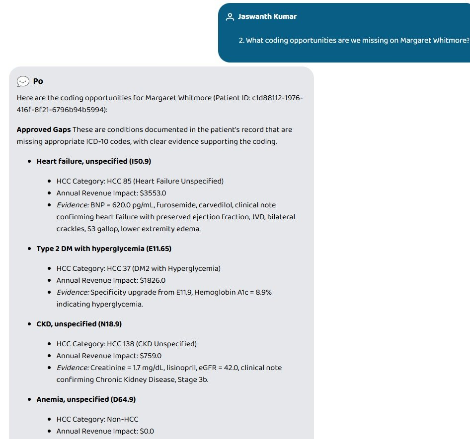
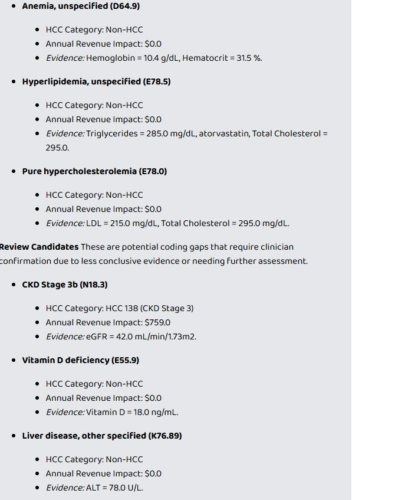
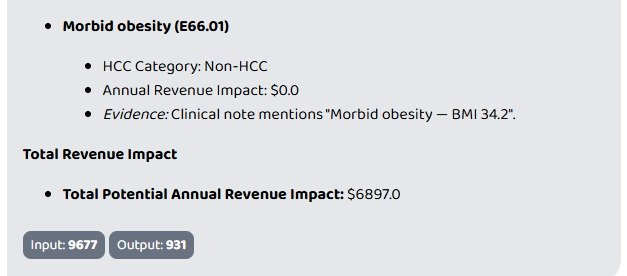

# Ctrl+Alt+Heal

> Find what the chart says but the codes don't.

An MCP server that detects missed ICD-10 codes by reading a patient's full clinical record from any FHIR R4 source. Built for the [Agents Assemble](https://agents-assemble.devpost.com/) hackathon, but designed for production use.

The problem we set out to solve: clinicians document conditions they don't always code. A note that says "uncontrolled diabetes with hyperglycemia" often gets billed as `E11.9` (diabetes, unspecified) when it should be `E11.65`. That single specificity gap is worth ~$1,800/year per patient under CMS HCC risk adjustment. Multiply by a Medicare Advantage panel and the dollars get serious.

We're a [Path A submission](https://agents-assemble.devpost.com/) — we built the MCP "Superpower." The Prompt Opinion platform handles the agent side of things; we focus on the detection engine.

---

## Live demo

Below is the actual output from running our MCP server against Margaret Whitmore — a 68-year-old multi-morbid synthetic patient — through the Prompt Opinion platform.

### The question

> *"What coding opportunities are we missing on Margaret Whitmore?"*

### The response

The agent calls our `detect_coding_gaps` tool. ~2 seconds later, it returns 10 gaps split into approved findings and review candidates, each with HCC categories, RAF-derived revenue impact, and a clinical evidence trail.



The system caught a **specificity upgrade** — the patient is currently coded as `E11.9` (diabetes, unspecified), but with HbA1c at 8.9%, the correct code is `E11.65` (Type 2 DM with hyperglycemia). That single upgrade adds **$1,826/yr** to her risk score under CMS V28.

It also identified heart failure and CKD that were documented in the progress note but never coded — backed by lab evidence (BNP 620, eGFR 42), medication evidence (furosemide, carvedilol, lisinopril), and direct quotes from the assessment and plan section.



Lower-confidence findings are surfaced as **review candidates** — gaps where the evidence is suggestive but warrants clinician confirmation. Each one still includes the supporting evidence so a coder can validate quickly.



**Total potential annual revenue impact for one patient: $6,897.** Across a Medicare Advantage panel, this scales into seven figures.

---

## What you get

Five tools, exposed over MCP, that any agent can pick up:

| Tool | What it does |
|------|--------------|
| `detect_coding_gaps` | Runs the full pipeline against a patient and returns gaps with HCC categories and revenue impact |
| `get_patient_summary` | Pulls a structured snapshot — demographics, active conditions, recent labs, current meds, encounters |
| `validate_gap` | Re-checks a specific gap against MEAT criteria (Monitoring, Evaluation, Assessment, Treatment) |
| `list_detected_gaps` | Queries previously detected gaps with filters by decision, HCC category, or code range |
| `draft_physician_query` | Generates an audit-ready query the provider can review and sign |

Live at: `https://ctrl-alt-heal-717323347388.us-central1.run.app/mcp`

---

## How detection works

The pipeline runs in four tiers. Each tier is independent and uses different evidence — when the same gap shows up in multiple tiers, confidence goes up.

**Tier 1 — Structured lab evidence.** 30+ LOINC codes mapped to ICD-10 thresholds drawn from KDIGO, AHA, ATA, and ATP-III guidelines. HbA1c ≥ 6.5 maps to `E11.65`. eGFR < 60 maps to `N18.3`. BNP > 400 maps to `I50.9`. Deterministic. Auditable.

**Tier 2 — Phenotype corroboration.** PheKB and OHDSI-style rules covering 12 chronic conditions. Each condition requires evidence from at least two of three sources: medications (mapped to RxNorm), labs (mapped to LOINC), and clinical notes (mapped to text patterns). A patient on metformin + Lisinopril whose chart mentions "Type 2 diabetes" but has no `E11.x` code is a strong gap.

**Tier 3 — Clinical NER.** Reads the unstructured text. Runs ClinicalBERT (`d4data/biomedical-ner-all`) when GPU is available; falls back to a 23-pattern regex matcher on CPU. Layered on top: section detection (HPI vs. Assessment/Plan), negation handling via NegSpacy + ConText, and a screening-context filter to keep "screening for depression" from being flagged as MDD.

**Tier 4 — Specificity upgrades.** Catches a different gap class: when an existing code should be more specific. `E11.9` coded + HbA1c ≥ 6.5% in labs → upgrade to `E11.65`. Patient has both `E11.x` and `N18.x` coded separately → combination code `E11.22` is required by ICD-10 guidelines. This is often where the most revenue lives in real coding workflows.

After detection, every candidate gets scored against CMS V28 HCC categories for revenue impact and validated against MEAT criteria for audit defensibility.

---

## SHARP compliance

The server implements the [SHARP-on-MCP](https://www.sharponmcp.com/) extension to MCP. Specifically:

- The `initialize` response advertises `fhir_context_required: true` under capabilities
- Tool calls accept three headers: `X-FHIR-Server-URL`, `X-FHIR-Access-Token`, `X-Patient-ID`
- The server uses those headers to authenticate against any FHIR R4 endpoint — Prompt Opinion's hosted FHIR, HAPI, or a real EHR

The Prompt Opinion platform handles credential bridging into SHARP context. We just consume the headers and use them.

---

## Architecture

```
Clinician
    │
    ▼  natural language query
┌─────────────────────────────────────────┐
│ Prompt Opinion (Multi-agent workspace)  │
│   • Configured Agent: Ctrl+Alt+Heal     │
│   • Injects SHARP headers               │
└─────────────────────────────────────────┘
    │
    ▼  MCP call (JSON-RPC 2.0)
       SHARP headers: X-FHIR-Server-URL, X-FHIR-Access-Token, X-Patient-ID
┌─────────────────────────────────────────┐
│ MCP Server (GCP Cloud Run, Python)      │
│   5 tools                               │
│   FHIR R4 REST adapter                  │
└─────────────────────────────────────────┘
    │                                  │
    │ pulls patient data               │ runs detection
    ▼                                  ▼
┌──────────────────┐          ┌────────────────────────┐
│ FHIR R4 Server   │          │ 4-tier pipeline        │
│ Patient,         │          │  Tier 1: Labs (LOINC)  │
│ Condition,       │          │  Tier 2: Phenotypes    │
│ Observation,     │          │  Tier 3: Clinical NER  │
│ MedicationRequest│          │  Tier 4: Specificity   │
│ DocumentReference│          │ + HCC scoring          │
│ Encounter,       │          │ + MEAT validation      │
│ Procedure        │          └────────────────────────┘
└──────────────────┘
```

---

## Quick start

```bash
git clone https://github.com/kishanraj41/Medical-Gap-Detection.git
cd Medical-Gap-Detection

pip install -r requirements.txt

# Point at any FHIR R4 server
export FHIR_SERVER_URL=https://hapi.fhir.org/baseR4
python mcp_server.py
```

Server runs on `http://localhost:8000/mcp`.

### Test it

```bash
# Health check
curl http://localhost:8000/health

# MCP initialize — should advertise fhir_context_required: true
curl -X POST http://localhost:8000/mcp \
  -H "Content-Type: application/json" \
  -d '{"jsonrpc":"2.0","id":1,"method":"initialize"}'

# List the 5 tools
curl -X POST http://localhost:8000/mcp \
  -H "Content-Type: application/json" \
  -d '{"jsonrpc":"2.0","id":2,"method":"tools/list"}'

# Detect gaps for a patient (replace PATIENT_ID with a real FHIR Patient ID)
curl -X POST http://localhost:8000/mcp \
  -H "Content-Type: application/json" \
  -H "X-FHIR-Server-URL: https://hapi.fhir.org/baseR4" \
  -d '{
    "jsonrpc":"2.0","id":3,"method":"tools/call",
    "params":{"name":"detect_coding_gaps","arguments":{"patient_id":"PATIENT_ID"}}
  }'
```

### Run with mock data

If you don't have a FHIR server handy, there's a mock one bundled with three test patients:

```bash
# Terminal 1
python mock_fhir_server.py    # listens on :9090

# Terminal 2
FHIR_SERVER_URL=http://localhost:9090 python mcp_server.py
```

Then call `detect_coding_gaps` with patient IDs `synth-001`, `synth-002`, or `synth-003`.

---

## Deploy to GCP Cloud Run

```bash
gcloud run deploy ctrl-alt-heal \
  --source . \
  --port 8000 \
  --allow-unauthenticated \
  --region us-central1 \
  --memory 1Gi
```

That's the actual command we used. The `--source .` flag lets Cloud Build handle the Docker image; you don't need to push to Container Registry separately.

---

## Validation

The pipeline has been tested in three ways:

**Unit tests (21/21 passing).** Ten synthetic patients designed to exercise specific behaviors: negation handling (Patient 5 should produce zero gaps), screening filtering (Patient 9's "screening for depression" should not be flagged), medication-only detection (Patient 6 has 6 meds but zero coded conditions), specificity upgrade detection (Patient 8's `E11.9` should be flagged for upgrade to `E11.65`).

**MTSamples corpus (2,227 real clinical transcriptions, zero processing errors).** We ran the pipeline against the [Kaggle MTSamples dataset](https://www.kaggle.com/datasets/tboyle10/medicaltranscriptions) — real medical transcriptions across 14 specialties (internal medicine, cardiology, endocrinology, nephrology, etc.). Results: 774 of 2,227 notes (34.8%) had at least one coding gap, with $1,134,540 in projected annual revenue impact.

**Live demo on Prompt Opinion.** Margaret Whitmore (screenshots above): 10 gaps detected in ~2 seconds, $6,897/year in projected revenue, all 4 tiers triggered, including the `E11.9 → E11.65` specificity upgrade.

---

## Repository structure

```
.
├── mcp_server.py             # FastAPI app, MCP protocol, 5 tool handlers
├── fhir_adapter.py           # FHIR R4 REST client, resource extraction
├── gap_pipeline.py           # 4-tier detection pipeline
├── mock_fhir_server.py       # Local test server (3 patients)
├── test_dataset.py           # 10 synthetic patients for unit tests
├── run_tests.py              # Test runner
├── test_mtsamples.py         # MTSamples corpus runner
├── agents/                   # 33-agent pipeline (CPU + GPU/CPU dual mode)
├── data/                     # LOINC ranges, phenotype rules
├── screenshots/              # Demo screenshots from Prompt Opinion
├── Dockerfile
└── requirements.txt
```

---

## Tech stack

**Protocols:** MCP 2024-11-05 · SHARP · FHIR R4 · JSON-RPC 2.0
**Coding systems:** ICD-10-CM · LOINC · RxNorm · CMS V28 HCC
**Knowledge sources:** PheKB · OHDSI · KDIGO · ATA · AHA · ATP-III · CMS coding guidelines
**NLP:** ClinicalBERT (`d4data/biomedical-ner-all`) · NegSpacy · medspaCy
**Runtime:** Python 3.11 · FastAPI · Uvicorn · GCP Cloud Run

---

## License

MIT

---

## Acknowledgments

Built on top of the SHARP-on-MCP reference work from the Prompt Opinion team. The four-tier detection design is informed by 19 production iterations on real clinical data, including substantial work resolving false positives from screening contexts, family history mentions, and code-family deduplication.